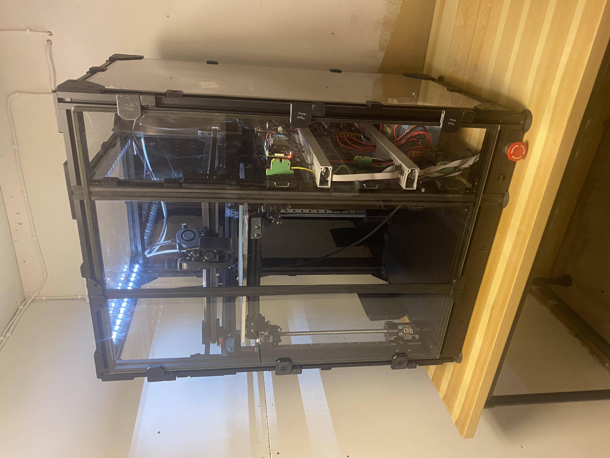

# HevORT HVT0097

This repo contains data on HVT0097. 

# Config

Klipper configs for HVT0097 (HD12 315x315x340) printer running fluidd.

Macros and config files are separeted in the folders.

# Main electronics

* Octopus Pro
* E3D motors (A/B: High Torque Motor, Z: Super Whopper Motor)
* Raspberry Pi 3b+ w/ [active cooling](https://www.amazon.se/gp/product/B08B84D8VH/ref=ppx_yo_dt_b_asin_title_o08_s00?ie=UTF8&th=1)
* Meanwell ‎NDR-240-24‎
* Meanwell NDR-120-12‎
* Keenovo silicone AC heater (300mm x 300mm 600W 220V/240V)
* SSR Omron G3NA-210B-UTU-DC5-24
* Afterburner Toolhead Board v3.rabbit
* DIN terminal blocks
* Type B Mini 12864 Display
* [Shelly 1PM+](https://github.com/jontek2/HVT0097-klipper_config/blob/main/moonraker.conf#L44-L50)

# Mods

* [Afterburner Toolhead Board v3.rabbit](https://github.com/VoronDesign/Voron-Hardware/tree/master/Afterburner_Toolhead_PCB)
* [C920 Mount](https://github.com/VoronDesign/VoronUsers/tree/master/printer_mods/Iakabos/C920_mount)
* [DIN fan](/mods/DIN_fan/)
* Frame thermistor
* [Nevermore v5 duo](https://github.com/nevermore3d/Nevermore_Micro/tree/master/V5_Duo/V2)
* [Voron Switchwire spool holder](https://github.com/VoronDesign/Voron-Switchwire/blob/master/STL/spool_holder_base.stl)
* [Voron LED Bar Clip - Remixed for 3030 from https://bit.ly/3CkBe5D](/mods/LED_bar_clip/)
* [Z umbilical](/mods/Z-umbilical/)
* [Voron Trident DIN mount- Remixed for 3030 from https://bit.ly/3tEoLph](/mods/DIN_frame_mount/)