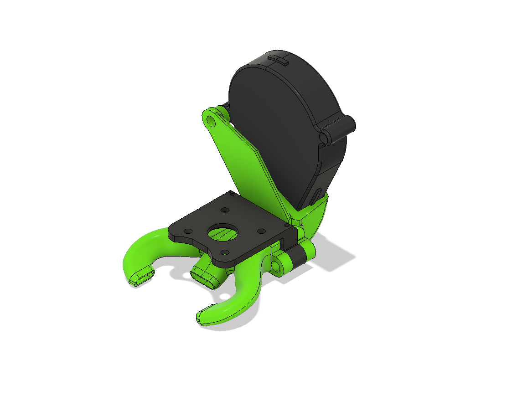

# Eva-Quickdraw-MGN12-Hextrudort mount

This is a annex quickdraw and a EVA fan duct mount for the HextrudOrt on MGN12. 

Cred to https://github.com/Annex-Engineering and discord user @Evomoto for inspiration.

# BOM

* 3 of m3 heatset inserts
* 2 of 6x3mm magnets
* 1 of 5015 fan
* 24 AWG PTFE wire
* 3 of M3x20
* 4 of M3x10